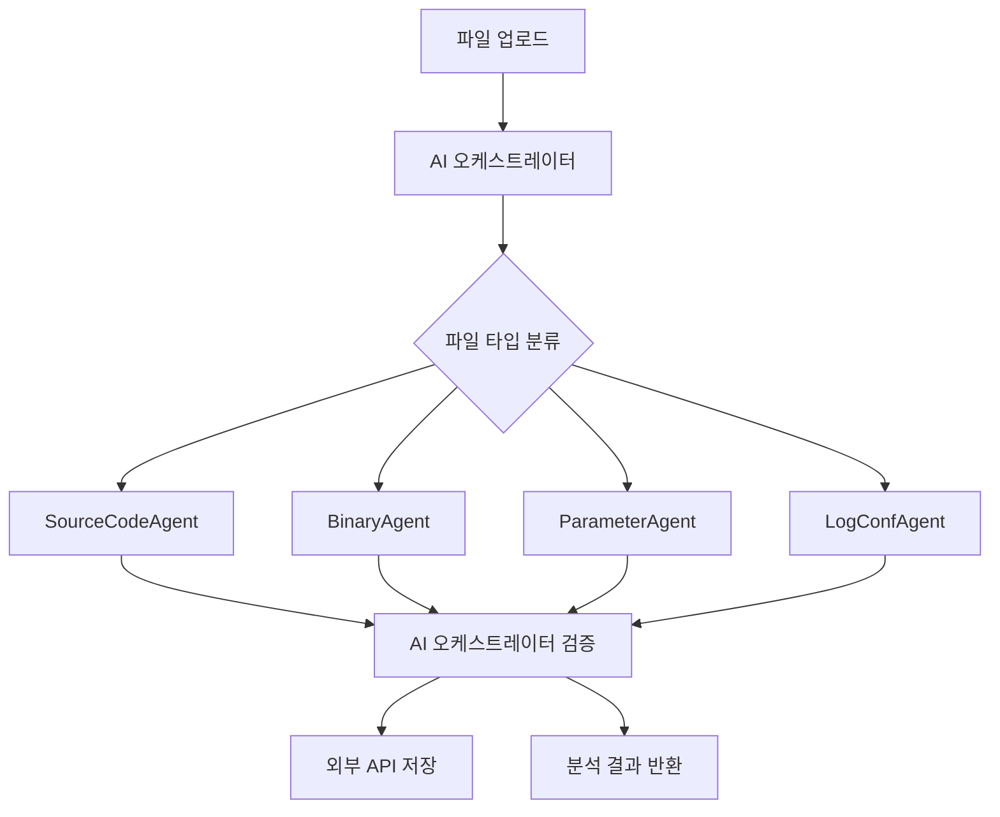

# 📖 PQC Inspector AI

양자내성암호(PQC) 전환을 돕기 위해 소스코드, 바이너리, 설정 파일 등에서 비양자내성암호(Non-PQC) 사용 여부를 탐지하는 **AI 기반 분석 시스템**입니다.

## ✨ 주요 기능

### 🧠 AI 오케스트레이터
- **지능형 파일 분류**: 업로드된 파일의 종류를 AI가 자동으로 분석하여 적절한 전문 에이전트에 할당
- **결과 검증 및 요약**: 에이전트 분석 결과를 검토하고 최종 품질 보장
- **Ollama 로컬 모델 활용**: `gemma:7b` 모델을 사용한 고성능 로컬 AI 처리

### 🤖 전문 에이전트 시스템
- **SourceCodeAgent**: 프로그래밍 언어 소스코드 전문 분석 (`codellama:7b`)
- **BinaryAgent**: 실행 파일 및 라이브러리 분석
- **ParameterAgent**: 설정 파일 및 매개변수 분석 (`gemma:7b`)
- **LogConfAgent**: 로그 파일 및 서버 설정 분석 (`gemma:7b`)

### 💾 외부 API 통합
- **데이터베이스 대신 외부 API 활용**: PostgreSQL 없이 경량화된 아키텍처
- **RESTful API 설계**: 다른 시스템과 쉽게 통합 가능
- **비동기 백그라운드 처리**: 대용량 파일 분석을 위한 효율적인 처리

## 🛠️ 시작하기

### 📋 사전 준비
- **Python 3.9+**
- **Ollama**: 로컬 AI 모델 실행을 위해 필요
- **MacBook Pro M4 24GB 권장**: AI 모델 실행을 위한 충분한 메모리

### 🚀 설치 및 실행

#### 1. 프로젝트 클론
```bash
git clone https://github.com/your-username/pqc-inspector.git
cd PQC-Inspector
```

#### 2. Ollama 설치 및 모델 다운로드
```bash
# Ollama 설치 (macOS)
brew install ollama

# Ollama 서비스 시작
ollama serve

# 필요한 AI 모델 다운로드 (별도 터미널에서)
ollama pull gemma:7b
ollama pull codellama:7b
```

#### 3. Python 환경 설정
```bash
python -m venv .venv
source .venv/bin/activate  # Windows: .venv\Scripts\activate
pip install -r requirements.txt
```

#### 4. 서버 실행
```bash
python main.py
```

#### 5. 접속 확인
- **로컬 접속**: http://127.0.0.1:8000
- **API 문서**: http://127.0.0.1:8000/docs
- **다른 기기에서 접속**: http://[맥북IP]:8000 (핫스팟 공유 시)

### 📱 네트워크 공유 (핫스팟)

다른 사람이 API를 사용하려면:
1. **맥북에서 핫스팟 활성화**
2. **다른 기기를 핫스팟에 연결**
3. **맥북 IP 확인**: `ifconfig | grep "inet " | grep -v 127.0.0.1`
4. **접속**: `http://[맥북IP]:8000`

## 🏗️ 시스템 아키텍처



### 🔄 분석 워크플로우
1. **파일 업로드** → AI 오케스트레이터가 파일 내용과 확장자 분석
2. **파일 분류** → 적절한 전문 에이전트 선택 (source_code, binary, parameter, log_conf)
3. **전문 분석** → 선택된 에이전트가 암호화 사용 패턴 탐지
4. **결과 검증** → AI 오케스트레이터가 분석 결과 품질 검토 및 요약
5. **저장 및 반환** → 외부 API에 결과 저장 후 사용자에게 반환

## 📁 프로젝트 구조

```
PQC-Inspector/
├── main.py                          # 🚀 애플리케이션 진입점
├── requirements.txt                  # 📦 Python 의존성
├── CLAUDE.md                        # 🤖 개발 가이드
├── README.md                        # 📖 프로젝트 문서
├── docs/
│   └── rag-training-plan.md         # 🧠 RAG 시스템 훈련 계획
├── test/                            # 🧪 테스트 파일들
│   ├── test_rsa.py                  # 기본 RSA 테스트
│   ├── test_hidden_crypto.py        # 숨겨진 암호화 테스트
│   └── test_stealth_crypto.c        # 고도로 위장된 C 암호화
└── pqc_inspector_server/
    ├── core/
    │   └── config.py                # ⚙️ 환경 설정
    ├── api/
    │   ├── endpoints.py             # 🛣️ API 라우터
    │   └── schemas.py               # 📋 데이터 모델
    ├── db/
    │   └── api_client.py            # 🌐 외부 API 클라이언트
    ├── services/
    │   └── ollama_service.py        # 🤖 Ollama AI 서비스
    ├── agents/
    │   ├── base_agent.py            # 👤 에이전트 기본 클래스
    │   ├── source_code.py           # 💻 소스코드 분석 에이전트
    │   ├── binary.py                # ⚡ 바이너리 분석 에이전트
    │   ├── parameter.py             # 📋 설정파일 분석 에이전트
    │   └── log_conf.py              # 📝 로그파일 분석 에이전트
    └── orchestrator/
        └── controller.py            # 🧠 AI 오케스트레이터
```

## 🌐 API 엔드포인트

### 📊 기본 엔드포인트
- **GET `/`**: 서버 상태 확인
- **GET `/docs`**: Swagger UI API 문서
- **GET `/redoc`**: ReDoc API 문서

### 🔍 분석 엔드포인트
- **POST `/api/v1/analyze`**: 파일 분석 요청
  ```bash
  curl -X POST "http://localhost:8000/api/v1/analyze" \
       -H "accept: application/json" \
       -H "Content-Type: multipart/form-data" \
       -F "file=@test/test_rsa.py"
  ```

- **GET `/api/v1/analyze/{task_id}`**: 분석 결과 조회
  ```bash
  curl -X GET "http://localhost:8000/api/v1/analyze/{task_id}"
  ```

### 📋 응답 형식
```json
{
  "task_id": "unique-task-identifier",
  "file_name": "test_rsa.py",
  "file_type": "source_code",
  "is_pqc_vulnerable": true,
  "vulnerability_details": "RSA 2048-bit encryption detected",
  "detected_algorithms": ["RSA"],
  "recommendations": "Replace with CRYSTALS-Kyber for quantum resistance",
  "evidence": "import rsa, rsa.newkeys(2048)",
  "confidence_score": 0.95,
  "orchestrator_summary": "High confidence RSA detection in Python code"
}
```

## 🧠 AI 모델 정보

| 역할 | 모델 | 용도 |
|------|------|------|
| 오케스트레이터 | `gemma:7b` | 파일 분류, 결과 검증 |
| 소스코드 분석 | `codellama:7b` | 프로그래밍 언어 코드 분석 |
| 바이너리 분석 | `codellama:7b` | 실행파일 분석 |
| 설정파일 분석 | `gemma:7b` | JSON, YAML, XML 등 분석 |
| 로그파일 분석 | `gemma:7b` | 로그 및 구성파일 분석 |

## 📚 추가 문서

- **[RAG 시스템 훈련 계획](docs/rag-training-plan.md)**: AI 에이전트 성능 향상을 위한 RAG 시스템 구축 계획
- **[CLAUDE.md](CLAUDE.md)**: 개발 환경 설정 및 상세 가이드

## 🧪 테스트 방법

프로젝트에는 AI 탐지 능력을 테스트하기 위한 다양한 난이도의 테스트 파일이 포함되어 있습니다:

1. **`test/test_rsa.py`**: 명확한 RSA 사용 - 쉬운 탐지
2. **`test/test_hidden_crypto.py`**: Python으로 위장된 RSA - 중간 난이도
3. **`test/test_stealth_crypto.c`**: C 언어로 고도로 위장된 RSA - 높은 난이도

```bash
# 테스트 실행 예제
cd test
python ../main.py &  # 서버 실행

# API로 테스트 파일 분석
curl -X POST "http://localhost:8000/api/v1/analyze" \
     -F "file=@test_stealth_crypto.c"
```

## 🔧 개발 및 기여

이 프로젝트는 양자 컴퓨팅 시대를 대비한 암호화 전환을 돕기 위해 개발되었습니다. 기여를 원하시면:

1. Fork the repository
2. Create a feature branch
3. Make your changes
4. Submit a pull request

## 📄 라이선스

MIT License - 자세한 내용은 LICENSE 파일을 참조하세요.