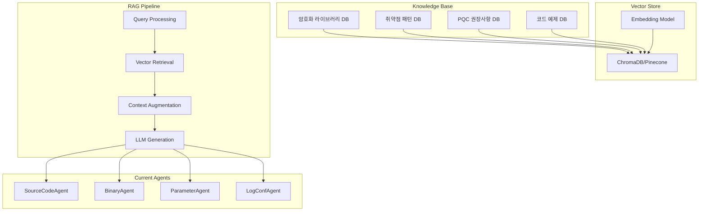

# 🧠 RAG 시스템 훈련 계획

## 📋 개요

PQC Inspector의 AI 에이전트들의 성능을 향상시키기 위한 **RAG (Retrieval Augmented Generation)** 시스템 구축 계획입니다. 전문 지식 데이터베이스를 활용하여 더 정확하고 상세한 암호화 탐지 및 분석을 수행할 수 있도록 합니다.

## 🎯 목표

### 1차 목표 (단기)
- **암호화 라이브러리 DB 구축**: 주요 암호화 라이브러리들의 API 패턴 수집
- **취약점 패턴 DB 구축**: 알려진 비양자내성 암호화 사용 패턴 데이터베이스 구축
- **벡터 검색 시스템 구현**: 코드 패턴을 벡터화하여 유사도 기반 검색

### 2차 목표 (중기)
- **동적 학습 시스템**: 새로운 탐지 결과를 바탕으로 지식 베이스 자동 업데이트
- **멀티모달 RAG**: 소스코드, 바이너리, 문서를 통합 분석
- **컨텍스트 어웨어 분석**: 프로젝트 전체 맥락을 고려한 분석

### 3차 목표 (장기)
- **실시간 위협 인텔리전스**: 최신 양자 암호화 연구 동향 자동 수집
- **자가 진화 AI**: 탐지 우회 기법에 대응하는 자동 학습 시스템

## 🏗️ RAG 시스템 아키텍처



## 📚 지식 베이스 구축 계획

### 1. 암호화 라이브러리 데이터 수집

#### 수집 대상 라이브러리
```json
{
  "python": {
    "vulnerable": ["pycryptodome", "cryptography", "rsa", "ecdsa"],
    "quantum_safe": ["kyber-py", "dilithium-py", "sphincs-py"]
  },
  "java": {
    "vulnerable": ["BouncyCastle", "Java Cryptography Extension"],
    "quantum_safe": ["BouncyCastle PQC", "Kyber-Java"]
  },
  "c_cpp": {
    "vulnerable": ["OpenSSL", "libgcrypt", "Crypto++"],
    "quantum_safe": ["liboqs", "PQClean"]
  },
  "javascript": {
    "vulnerable": ["node-rsa", "crypto-js", "elliptic"],
    "quantum_safe": ["pqc-js", "kyber-js"]
  }
}
```

#### 데이터 구조
```python
class CryptoPattern:
    library_name: str
    algorithm_type: str  # RSA, ECDSA, AES, etc.
    vulnerability_level: int  # 1-10 (quantum resistance)
    code_patterns: List[str]  # 실제 코드 패턴들
    file_extensions: List[str]
    import_statements: List[str]
    function_signatures: List[str]
    replacement_recommendations: str
    evidence_keywords: List[str]
```

### 2. 벤치마크 데이터셋 구축

#### 훈련 데이터 카테고리
- **Obvious Crypto**: 명확한 암호화 사용 (test_rsa.py 유형)
- **Hidden Crypto**: 위장된 암호화 사용 (test_hidden_crypto.py 유형)
- **Stealth Crypto**: 고도로 난독화된 암호화 (test_stealth_crypto.c 유형)
- **False Positives**: 암호화가 아닌 수학적 연산들
- **Quantum Safe**: 양자내성 암호화 사용 예제

#### 라벨링 스키마
```python
class AnalysisLabel:
    is_cryptographic: bool
    algorithm_family: str  # RSA, ECDSA, AES, Kyber, etc.
    quantum_vulnerable: bool
    confidence_human_expert: float
    difficulty_level: int  # 1-5 (탐지 난이도)
    obfuscation_techniques: List[str]
```

## 🔧 구현 계획

### Phase 1: 기본 RAG 시스템 (2주)

#### 1.1 벡터 데이터베이스 설정
```bash
# ChromaDB 설치 및 설정
pip install chromadb sentence-transformers

# 또는 Pinecone 사용
pip install pinecone-client
```

#### 1.2 임베딩 모델 선택
- **Code 전용**: `microsoft/codebert-base` 또는 `microsoft/unixcoder-base`
- **멀티모달**: `all-MiniLM-L6-v2` (텍스트 + 코드)
- **로컬 실행**: `sentence-transformers/all-mpnet-base-v2`

#### 1.3 기본 구현
```python
# 파일: pqc_inspector_server/rag/vector_store.py
class VectorStore:
    def __init__(self, collection_name: str):
        self.client = chromadb.Client()
        self.collection = self.client.create_collection(collection_name)
        self.embedding_model = SentenceTransformer('all-MiniLM-L6-v2')
    
    def add_crypto_patterns(self, patterns: List[CryptoPattern]):
        # 패턴들을 벡터화하여 저장
        pass
    
    def search_similar_patterns(self, code_snippet: str, k: int = 5):
        # 유사한 패턴 검색
        pass

# 파일: pqc_inspector_server/rag/knowledge_retriever.py
class KnowledgeRetriever:
    def __init__(self, vector_store: VectorStore):
        self.vector_store = vector_store
    
    async def get_relevant_context(self, file_content: str, file_type: str) -> str:
        # 관련 컨텍스트 검색 및 반환
        pass
```

### Phase 2: 에이전트 RAG 통합 (1주)

#### 2.1 SourceCodeAgent 업그레이드
```python
class EnhancedSourceCodeAgent(BaseAgent):
    def __init__(self):
        super().__init__(settings.SOURCE_CODE_MODEL)
        self.knowledge_retriever = KnowledgeRetriever(vector_store)
    
    async def analyze_with_rag(self, file_content: bytes, file_name: str) -> Dict[str, Any]:
        # 1. 기본 분석
        content_text = self._parse_file_content(file_content)
        
        # 2. RAG 컨텍스트 검색
        relevant_context = await self.knowledge_retriever.get_relevant_context(
            content_text, "source_code"
        )
        
        # 3. 강화된 프롬프트 생성
        enhanced_prompt = self._create_rag_prompt(content_text, relevant_context)
        
        # 4. LLM 호출 및 결과 반환
        return await self._call_llm(enhanced_prompt)
    
    def _create_rag_prompt(self, code: str, context: str) -> str:
        return f"""
        Based on the following expert knowledge about cryptographic patterns:
        
        EXPERT CONTEXT:
        {context}
        
        Analyze this code for quantum-vulnerable cryptography:
        
        CODE:
        {code}
        
        Provide detailed analysis in JSON format...
        """
```

### Phase 3: 지식 베이스 자동 확장 (2주)

#### 3.1 온라인 데이터 수집
```python
# 파일: scripts/knowledge_collector.py
class CryptoKnowledgeCollector:
    async def collect_github_patterns(self):
        # GitHub에서 암호화 사용 패턴 수집
        pass
    
    async def collect_cve_data(self):
        # CVE 데이터베이스에서 암호화 취약점 정보 수집
        pass
    
    async def collect_pqc_research(self):
        # arXiv, 학술 논문에서 최신 PQC 연구 동향 수집
        pass
```

#### 3.2 자동 라벨링 시스템
```python
class AutoLabeler:
    def __init__(self, expert_model: str = "gpt-4"):
        self.expert_model = expert_model
    
    async def auto_label_code_samples(self, code_samples: List[str]) -> List[AnalysisLabel]:
        # GPT-4 등 고성능 모델을 사용한 자동 라벨링
        pass
```

### Phase 4: 성능 평가 및 최적화 (1주)

#### 4.1 평가 메트릭
- **정확도**: True Positive Rate, False Positive Rate
- **재현율**: 알려진 취약점 탐지율
- **F1 스코어**: 정확도와 재현율의 조화평균
- **응답 시간**: RAG 시스템 추가로 인한 지연시간
- **비용 효율성**: 토큰 사용량 대비 성능 향상

#### 4.2 A/B 테스트 설계
```python
class RAGEvaluator:
    def __init__(self):
        self.baseline_agent = SourceCodeAgent()  # RAG 없음
        self.enhanced_agent = EnhancedSourceCodeAgent()  # RAG 포함
    
    async def compare_performance(self, test_dataset: List[TestCase]) -> EvaluationReport:
        # 두 에이전트 성능 비교
        pass
```

## 📊 데이터 수집 전략

### 1. 수동 큐레이션 (고품질 시드 데이터)

#### 소스 우선순위
1. **공식 암호화 라이브러리 문서**
   - OpenSSL, BouncyCastle, Cryptography 공식 예제
   - NIST PQC 표준 구현 예제

2. **보안 연구 논문**
   - 암호화 취약점 분석 논문의 코드 예제
   - PQC 마이그레이션 가이드라인

3. **CVE 데이터베이스**
   - 실제 발생한 암호화 관련 취약점 사례

### 2. 자동 수집 (대량 데이터)

#### GitHub Mining
```python
# 예시: GitHub에서 RSA 사용 패턴 수집
search_queries = [
    "language:python rsa.encrypt",
    "language:java RSA/ECB/PKCS1Padding",
    "language:c++ openssl RSA_public_encrypt",
    "language:go crypto/rsa GenerateKey"
]
```

#### Stack Overflow Mining
- 암호화 관련 질문과 답변에서 코드 패턴 추출
- 특히 "보안 문제" 태그가 있는 답변들

### 3. 합성 데이터 생성

#### 코드 변형 기법
```python
class CodeObfuscator:
    def generate_variants(self, original_code: str) -> List[str]:
        variants = []
        
        # 1. 변수명 변경
        variants.append(self.rename_variables(original_code))
        
        # 2. 함수 분할
        variants.append(self.split_functions(original_code))
        
        # 3. 수학적 동등 변환
        variants.append(self.mathematical_transform(original_code))
        
        # 4. 주석 및 문자열 변경
        variants.append(self.change_comments(original_code))
        
        return variants
```

## 🎯 평가 및 벤치마킹

### 평가 데이터셋 구성
- **Easy**: 명시적 라이브러리 사용 (300개)
- **Medium**: 일부 위장된 구현 (200개)
- **Hard**: 고도로 난독화된 구현 (100개)
- **False Positives**: 비암호화 수학 코드 (200개)

### 성능 목표
- **Easy**: 95% 이상 정확도
- **Medium**: 85% 이상 정확도  
- **Hard**: 70% 이상 정확도
- **False Positive Rate**: 5% 이하

### 지속적 개선 프로세스
1. **주간 성능 리뷰**: 새로운 테스트 케이스로 성능 측정
2. **월간 지식 베이스 업데이트**: 새로운 패턴 및 라이브러리 추가
3. **분기별 모델 업그레이드**: 더 나은 임베딩 모델로 마이그레이션

## 🛠️ 구현 우선순위

### 즉시 시작 (1주차)
1. ChromaDB 설정 및 기본 벡터 스토어 구현
2. 기존 테스트 파일들로 초기 지식 베이스 구축
3. SourceCodeAgent에 기본 RAG 통합

### 단기 (2-4주차)
1. 암호화 라이브러리 패턴 수집 자동화
2. 모든 에이전트에 RAG 통합
3. 성능 평가 시스템 구축

### 중기 (1-3개월)
1. 대규모 지식 베이스 구축
2. 실시간 학습 시스템 구현
3. 고급 난독화 탐지 기능

## 💡 추가 아이디어

### 1. 커뮤니티 기여 시스템
- 사용자가 새로운 패턴을 제보할 수 있는 시스템
- 크라우드소싱으로 지식 베이스 확장

### 2. 설명 가능한 AI
- RAG가 어떤 지식을 사용했는지 사용자에게 설명
- 탐지 근거를 구체적으로 제시

### 3. 다국어 지원
- 한국어, 일본어, 중국어 코드 주석 처리
- 다국어 암호화 라이브러리 지원

이 계획을 통해 PQC Inspector의 AI 에이전트들이 훨씬 더 정확하고 포괄적인 암호화 탐지를 수행할 수 있게 됩니다!